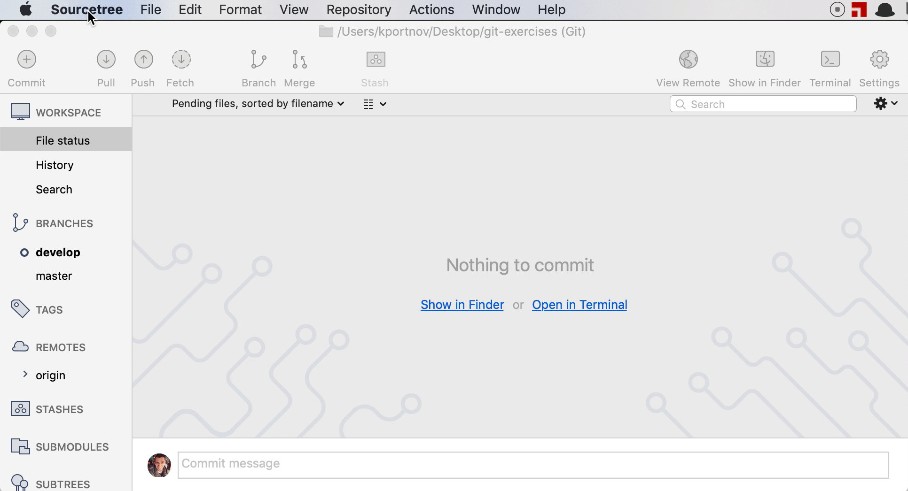
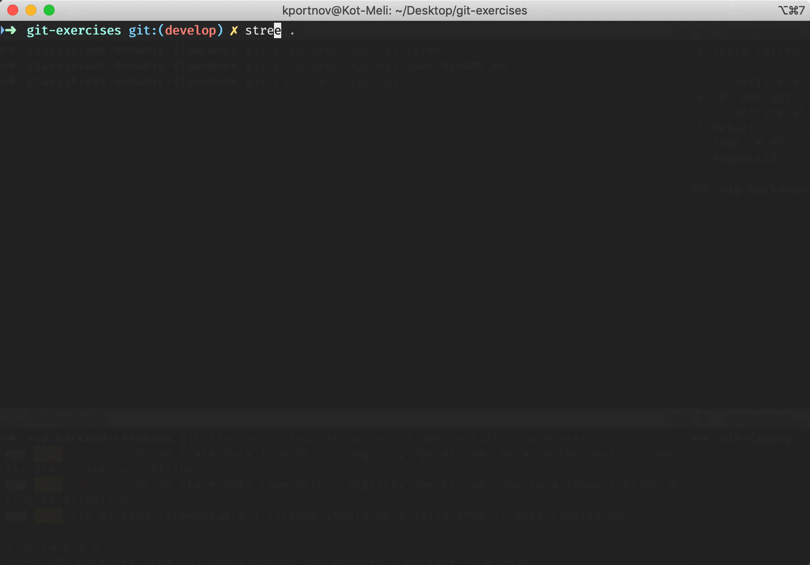

# SourceTree

SourceTree is a free Git client for Windows and Mac.  
SourceTree is awesome tool for visualize your Git history.

- Install [SourceTree](https://www.sourcetreeapp.com)

- Install CLI alias `stree`

And now you can open current repository in `SourceTree`

