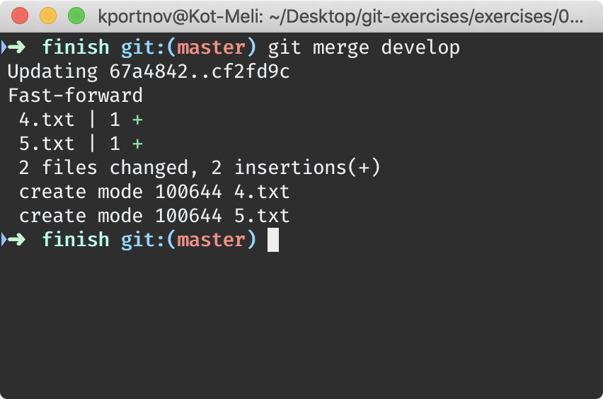
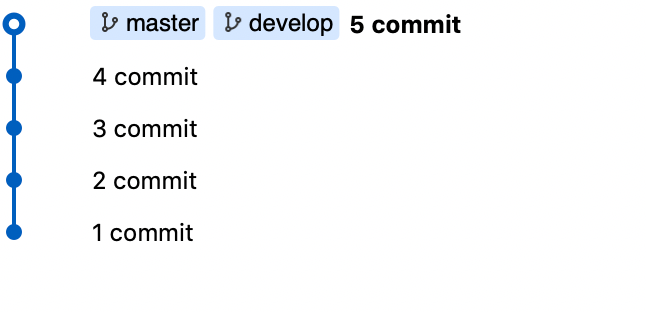
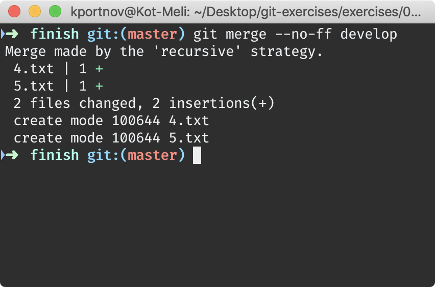
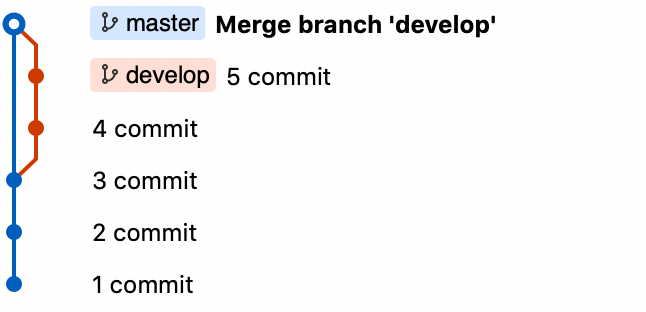
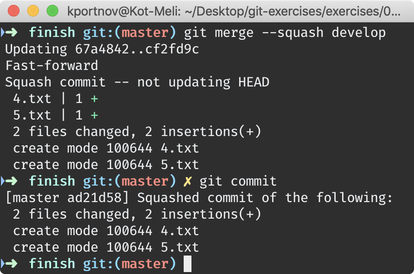
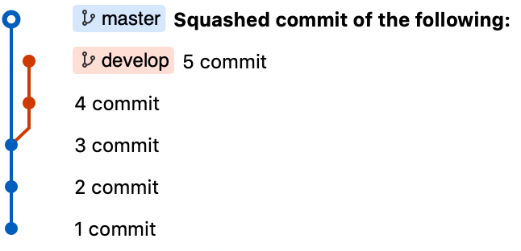
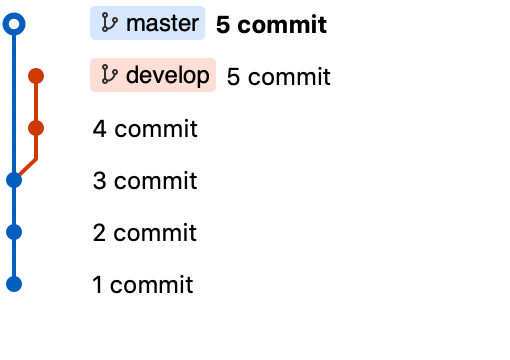
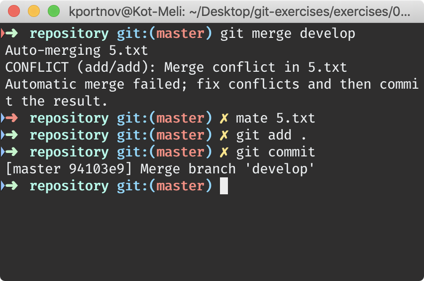
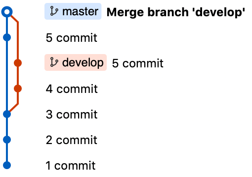

# Merge

## Fast-Forward Merge

⚠️ Use `repository.zip`

> ``` 
> $ git merge develop
> ```

| Before | Command | After |
|---|---|---|
|  |  |  |

## Non Fast-Forward Merge

⚠️ Use `repository.zip`

> ``` 
> $ git merge --no-ff develop
> ```

| Before | Command | After |
|---|---|---|
|  |  |  |

## Squash Merge

⚠️ Use `repository.zip`

> ``` 
> $ git merge --squash develop
> $ git commit
> ```

| Before | Command | After |
|---|---|---|
|  |  |  |

## Merge with Conflict

⚠️ Use `repository-with-conflict.zip`

> ``` 
> $ git merge develop
> $ mate 5.txt
> $ git add .
> $ git commit
> ```

| Before | Command | After |
|---|---|---|
|  |  |  |
