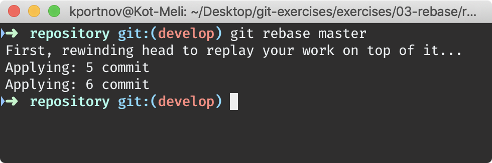
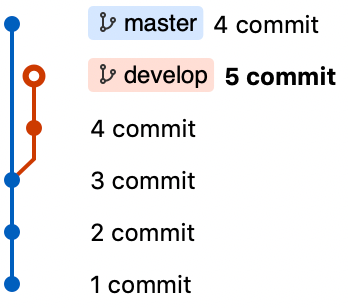
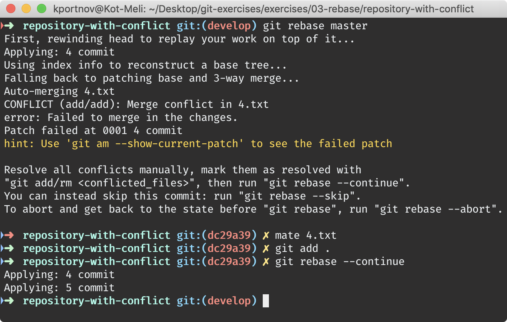
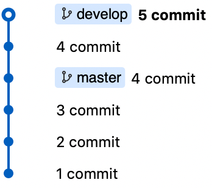
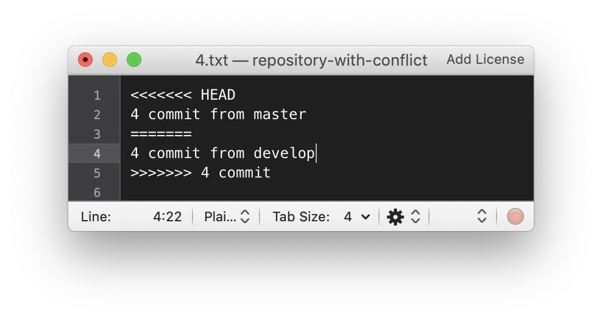
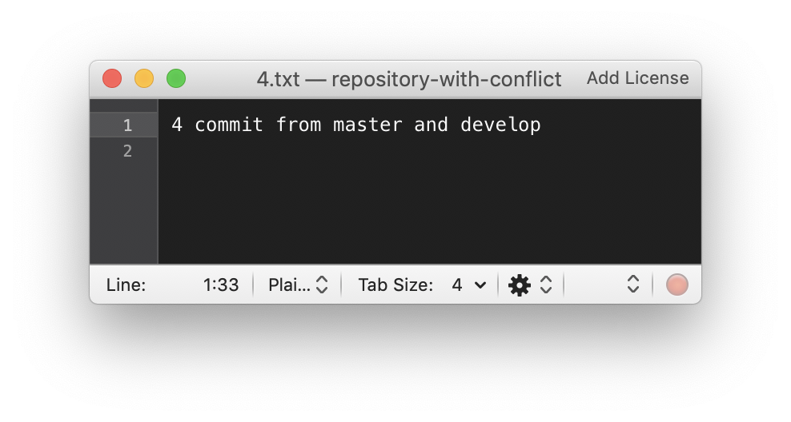

# Rebase

## Rebase without conflict

⚠️ Use `repository.zip`

> ``` 
> $ git rebase master
> ```

| Before | Command | After |
|---|---|---|
|  |  |  |

# Rebase with conflict

⚠️ Use `repository-with-conflict.zip`

> ``` 
> $ git rebase master
> $ mate 4.txt
> $ git add .
> $ git rebase --continue
> ```

| Before | Command | After |
|---|---|---|
|  |  |  |

| File with conflict | File without conflicts |
|---|---|
|  | 
