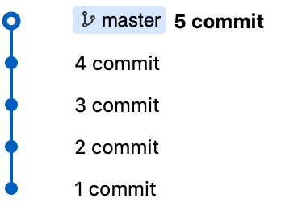
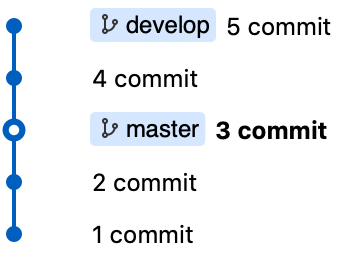

# Reset --hard

## 😰 I forgot create branch

⚠️ Use `repository.zip`

> ``` 
> $ git checkout -b develop
> $ git checkout master
> $ git reset --hard head~2
> ```

| Before | Command | After |
|---|---|---|
|  |  |  |