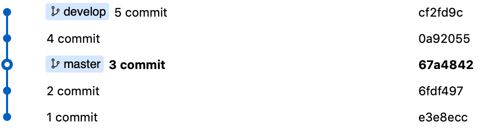
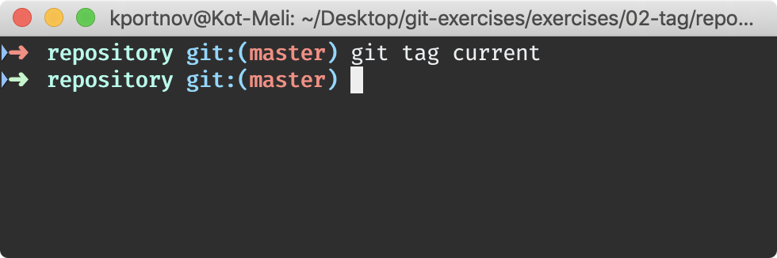
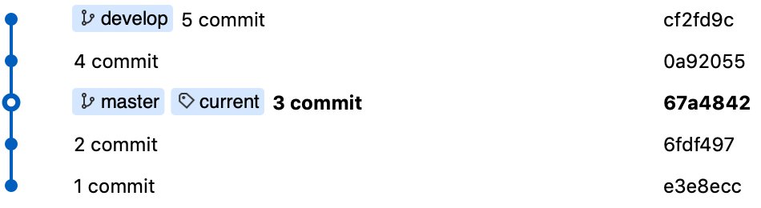
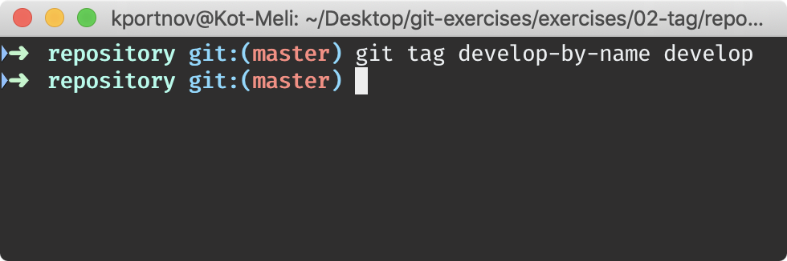
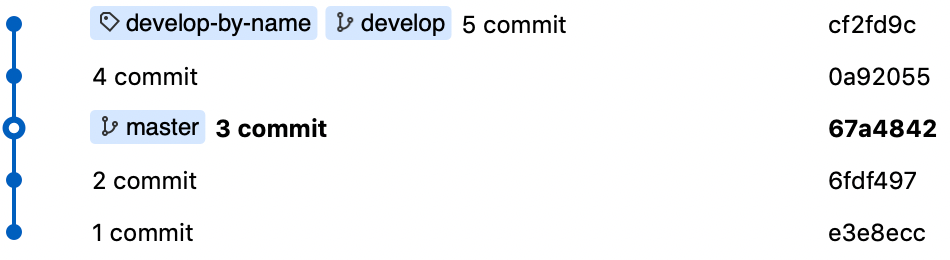
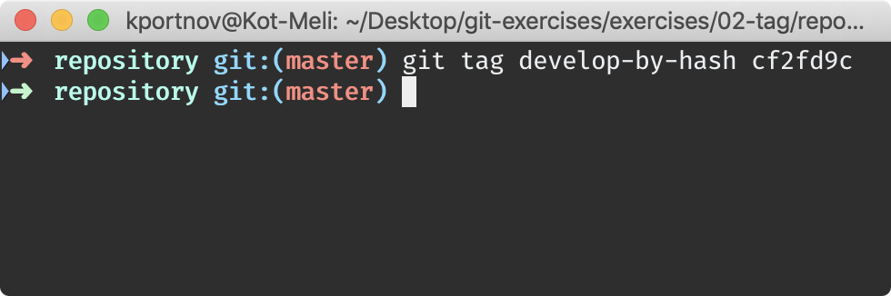
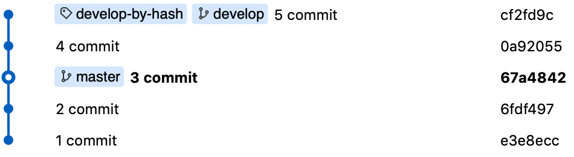
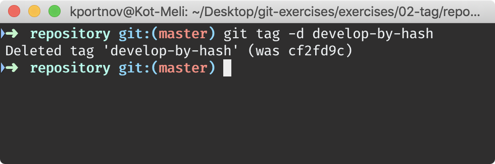

# Tags

⚠️ Use `repository.zip`

## Tag current commit

> ``` 
> $ git tag current
> ```

| Before | Command | After |
|---|---|---|
|  |  |  |

## Tag by reference name

> ``` 
> $ git tag develop-by-name develop
> ```

| Before | Command | After |
|---|---|---|
|  |  |  |

## Tag by hash

> ``` 
> $ git tag develop-by-hash cf2fd9c
> ```

| Before | Command | After |
|---|---|---|
|  |  |  |

## Remove tag

> ``` 
> $ git tag -d develop-by-hash
> ```

| Before | Command | After |
|---|---|---|
|  |  |  |
